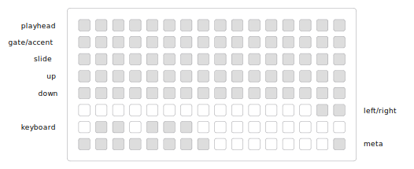

# audionerd/acid

a tb-303-style sequencer for crow + x0x-heart + grid

influenced by Julian Schmidt’s [“Analysis of the µPD650C-133 CPU timing”](http://sonic-potions.com/Documentation/Analysis_of_the_D650C-133_CPU_timing.pdf)

designed for use with the open source [x0x-heart + pacemaker](http://openmusiclabs.com/projects/x0x-heart)

## connections

crow out 1 → x0x-heart cv  
crow out 2 → x0x-heart gate  
crow out 3 → x0x-heart accent  
crow out 4 → x0x-heart slide  

clock → crow in 1 (optional)  

## sequencing

`playhead` row shows current step during playback, and a cursor for the currently selected step when editing.

for each step:
- `gate/accent` can be off, gate on, or accent on
- `slide` can be off or on
- `up`/`down` set the octave of the note

hold `meta` and press a step’s `gate/accent` to immediately turn it off.

hold `meta` and press a step’s top row to select that step.

`left/right` moves the cursor between steps. the `keyboard` will display the note assigned to the step, which can be changed by pressing a `keyboard` key.

to set a loop of less than 16 steps, hold a key on the top row for the start point, and press another key on the top row for the end point. the loop will run between those steps.

Patterns can be saved, loaded, overwritten, and removed via the `PARAMETERS` menu.

## future
- crow "satellite" mode (allow continued playback disconnected from norns, re-connect to edit pattern)
- random pattern generation
